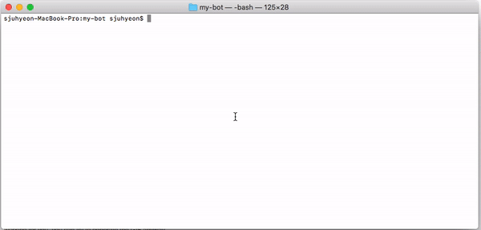

  </a>
  <h3 align="center">Public Bot</h3>
  
A discord.js bot that moderating server.

  

  

---

<!-- START doctoc generated TOC please keep comment here to allow auto update -->
<!-- DON'T EDIT THIS SECTION, INSTEAD RE-RUN doctoc TO UPDATE -->

 

